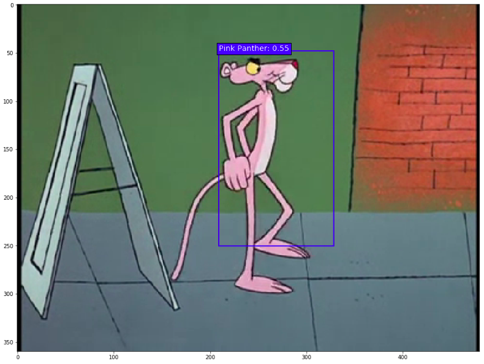

# Pink-Panther-SSD-Keras
Small hack which performs detection of Pink Panther and The Little Man using SSD7 built in Keras. The iteresting thing is that it learns in a very few samples.



## Description of Files
Following is the list of files in the model:

1. run.py: Main file to run for the module, handles both training and testing

```bash
usage: run.py [-h] [--url URL] [--train TRAIN] [--labels LABELS]
              [--batch-size BATCH_SIZE] [--epochs EPOCHS] [--model MODEL]
              [--opdir OPDIR] [--debug DEBUG]

optional arguments:
  -h, --help               show this help message and exit
  --url URL                train URL
  --train TRAIN            bool whether training or not
  --labels LABELS          path to labels file
  --batch-size BATCH_SIZE  mini batch size
  --epochs EPOCHS          number of training epochs
  --model MODEL            path to model
  --opdir OPDIR            folder for writing logs
  --debug DEBUG            give debug outputs
```
2. layers.py: Custom Keras Layers
3. ssd_utils.py: Basic util functions
4. ssd_box_encode_decode_utils.py: functions required to convert formats

## Train the Model
Model is a small SSD7 model, which was chosen as it has light weight and is quite fast for just 2 classes. For training a seperate file with bounding boxes needs to be provided. Before training the model need to follow these steps:
   1. Folder `frames` has all the frames required for training and `final.csv` has the labels
   2. Train the model using command
```bash
   $ python3 run.py --train=True --labels=./final.csv
```
This shold take about 15-20 minutes depending on the system

## Run the Model

Note that you need to train the model before running deployment. The model should be
saved in the folder as 'ssd_7.h5' and weights will be saved as 'ssd_weights.h5'. To run the
inference on any video run the command:
```bash
    $ export YTLINK="https://www.youtube.com/watch?v=GXfWeDogVUg"
    $ python3 run.py --model=./ssd7_weights.h5 --url=$YTLINK
```